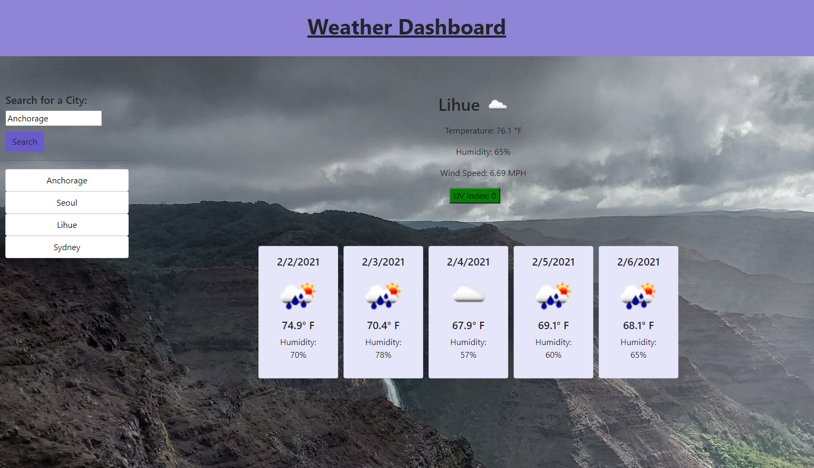

# WeatherDashboard

# Purpose

This feature allows a user to input a city into the search bar and have the weather for the current day displayed as well as a 5 day forecast. The city will then be prepended to a list allowing the user to enter additional cities. The user will be able to click each city to have it repopulate its information. Upon refreshing the page, the most recent city will repopulate and previously searched citites will be available to select.

# Usage

Click <a href="https://perkyderm.github.io/WeatherDashboard/">here</a> to go to the application. Input a city into the search bar and click search to see your city.

# Preview

# Note

This is a WIP.
